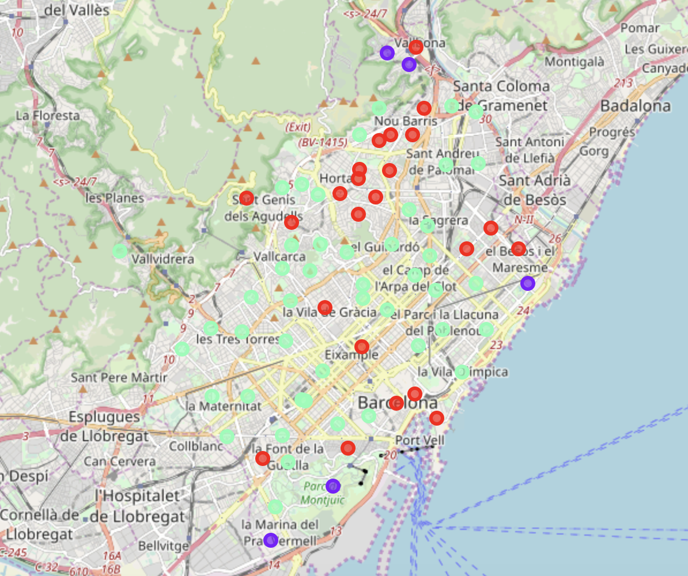

# Restaurants in the neighbourhoods of Barcelona

This is the report for the Week 5 assignment of the Applied Data science capstone course.

## Introduction

The Foursquare app provides information about venues and users around a specific location. The app allows you to **search** venues of a specific category around a location (specified with longitude and latitude values), and to **explore** the popular or trending spots around a location.

The information provided by the Foursquare app is relevant for entrepreneurs looking for a location to establish her/his business. Place is one of the 4 Ps of the marketing mix (the other being product, price and promotion), and it is absolutely crucial in the restaurant industry.

The aim of my final capstone project is **to find the adequate city neighbourhood to open a restaurant of a specific category, based on restaurants existing in a district**. The idea behind the project is that people will tend to look for restaurants of a specific category in places where they know that there are restaurants of this kind. For instance, if you are looking for a Paella Restaurant in Barcelona, you will go to the Barceloneta neighbourhood, near to the sea and the traditional location of fish and paella restaurants.

My intention is to develop a template to cluster neighbourhoods around types of restaurants with the neighbourhoods of my city, Barcelona. Barcelona has a growing tourist industry, and this analysis can be specially interesting for Barcelonian entrepreneurs looking to open a new restaurant venue. The template can be used for anyone that wants to explore the possibilities of opening a restaurant in a city.

## Data

Foursquare app allows to explore the venues around a location, so it is perfect to the aims of this project. But first we need information about **location of Barcelona neighbourhoods**. Specifically, we need a data frame with the name of each neighbourhood, and its latitude and longitude.

Once we have neighbourhood locations, we need a list of **venues of each neighbourhood**, from which we will obtain the **restaurants of each neighbourhood**.

## Methodology

The project has three main steps:

- Data acquisition
- Data analysis
- Interpretation of analysis results

Interpretation of analysis results is about judgement and knowledge about the analysis outputs. Data acquisition and analysis require specific methodological decisions.

### Data acquisition

I have obtained the location of **Barcelona neighbourhoods** scratching **Wikipedia websites** using **Beautiful Soup**. I have proceeded in two steps:

- First, I have obtained the links to all Wikipedia pages of Barcelona neighbourhoods through the [Barcelona neighbourhoods cathegory](https://es.wikipedia.org/wiki/Categor%C3%ADa:Barrios_de_Barcelona) website. We can find cathegory pages like these for other cities, like [Madrid](https://es.wikipedia.org/wiki/Categor%C3%ADa:Barrios_de_Madrid) or [Paris](https://en.wikipedia.org/wiki/Category:Arrondissements_of_Paris)
- The list of links points of pages [like this one](https://es.wikipedia.org/wiki/El_Raval), that allow obtaining geographical information. 

The result of this first step of data acquisition is a data frame containing the **name**, the **longitude** and **latitude** of each neighbourhood. This information can be retrieved from the csv file available [here](https://github.com/jmsallan/MLCapstone/blob/master/barrisBCN.csv).

Once we have the list of neighbourhood locations, we need to retrieve **venues** from each location. The **Foursquare location data** have been obtained making search calls for each neighbourhood, with a **radius** of 1,000 meters and a limit of 400 venues. The 6,026 venues I have obtained this way can be found [here](https://github.com/jmsallan/MLCapstone/blob/master/llocsBCN.csv).

Once obtained the venues list, I have filtered the venues that are restaurants to obtain a **restaurant list**. To do so, I have used regular expressions in the venue categories, to detect restaurant categories. These are the categories containing the string **'Restaurants'**. I have obtained a list of 1,908 restaurants, each with its neighbourhood.

### Data analysis

The detection of neighbourhood categories is an unsupervised learning process, as we do not have *a priori* categories defined for each neighbourhood. I have used **k-means clustering** to clustering neighbourhoods. The input for the clustering algorithm is a matrix with the proportion of each venue from the total present in each neighbourhood.

I have tried with several values of number of clusters *k*. For values of *k* above three, we find that the algorithm obtains clusters of one or two items, so I have decided to retain **k=3** clusters. To find common properties of each cluster, I have retained the **10 most common category venues for each neighbourhood**. 

## Results

The results of the clustering can be summarized in the following map of Barcelona, where neighbourhood locations belonging to a the same cluster are presented with a dot of the same color:

The three clusters found are:

- **Cluster 1**, in red, including 23 neighbourhoods. In neighbourhoods of this cluster, **Tapas Restaurant** and **Spanish Restaurant** are the most common restaurant categories.
- **Cluster 2**, in purple, including five neighbourhoods. The most common restaurant category of this cluster is **Mediterranean Restaurant**.
- **Cluster 3**, in light blue, of 46 neighbourhoods. The most common category of this venue are **Spanish Restaurant** and **Restaurant**.

## Discussion

The result of the analysis gives non-evident insights about resturant business in Barcelona. Differences across clusters can be interpreted in terms of the use than people makes of restaurants:

- Restaurant as leisure place, where locals meet with friends and tourist come for lunch and dinner, and to experience local food.
- Restaurant as convenience place, where locals come by noon on workdays to have lunch.

The most common restaurant category in **cluster 1 (red)** is Tapas Restaurant. Tapas restaurants offer small plates (tapas, in Spanish) of Spanish food (e.g., *patatas bravas*). Tapas are always enjoyed in a context of leisure, either by tourists (in city centre neighbourhoods) or by locals (in the north neighbourhoods). Tourists can visit northern neighbourhoods (e.g. Horta or Turo de la Peira) for a more authentic tapas experience.

In **cluster 2 (purple)** the most common category is Mediterranean Restaurant. These restaurants offer pizza and pasta, together with some Spanish specialities. These restaurants can be visited either by leisure or at a working pause at noon. These neighbourhoods have also a varied offer of international cuisine restaurants, sometimes owned by immigrant entrepreneurs.

**Cluster 3** (light blue) covers more than one half of Barcelona. In those neighbourhoods the predominant restaurant categories are Restaurant or Spanish Restaurant, followed by Mediterranean restaurant. People is going to these restaurants in the working pause. In Spain there is a tradition of making a long work stop (sometimes from 14 to 16) to have a strong lunch, with two plates and dessert. This is offered in Spanish Restaurants and Restaurants, and sometimes in Mediterranean Restaurants as *Menu del dia*. So we can expect that most of the revenue of these restaurants will be obtained in midday in working days, and that the leisure restaurant market is less buoyant in those neighbourhoods.

## Conclusion

The information provided by the clustering of neighbourhoods by restaurant category using information from Foursquare location data gives additional insight to entrepreneurs that aim to open a new restaurant in Barcelona. In particular, we have found that:

- People in Barcelona come to neighbourhoods of **cluster 1** to meet with friends (locals) or to enjoy Spanish food (tourist). People wanting to open tapas restaurants may want to explore those places. Revenues of restaurants in cluster 1 are expected to be obtained by night and weeekends.
- In neighbourhoods of **cluster 3** the most common restaurants are spanish restaurants, where people come by noon on workdays to have menu del dia for lunch. Revenues on this cluster will be obtained mainly by noon on working days.
- In neighbourhoods of **cluster 2** we will find Mediterranean restaurants (offering pizza, pasta and local food) and international restaurants. Like cluster 1, people come to these restaurants for leisure.

This analysis offers information about people's habits of interest for people wanting to start a restaurant business. This information must be complemented with information about real state market: for instance, Tapas bar can be opened more easily in neighbourhoods on the north of Barcelona belonging to cluster 1, where renting a place to open a restaurant can be cheaper. Futher analysis can be undertaken with the Foursquare app exploring trending venues in different moments of the week (weekends and working days) and of the day (working hours and night).